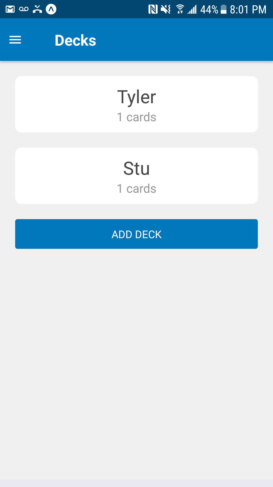

Flashcards
===

A React Native app for creating flashcards and quizzes. This app gives you the ability to:

* Create a deck of flashcards
 * Create multiple flashcards within a deck
 * Take a quiz for each deck of flashcards

The app should work in both Android and iOS.

## Install

```
git clone git@github.com:drewsmith/flashcards.git
yarn install
yarn start
```

Follow the instructions to test on your emulator of choice

## iOS


## Android



## Building

```
exp build:android
exp build:ios
```
