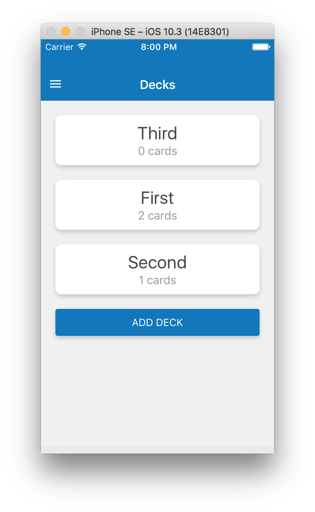

Flashcards
===

A React Native app for creating flashcards and quizzes.

## Install

```
git clone git@github.com:drewsmith/flashcards.git
yarn install
yarn start
```

Follow the instructions to test on your emulator of choice

iOS



Android


Building

```
exp build:android
exp build:ios
```
